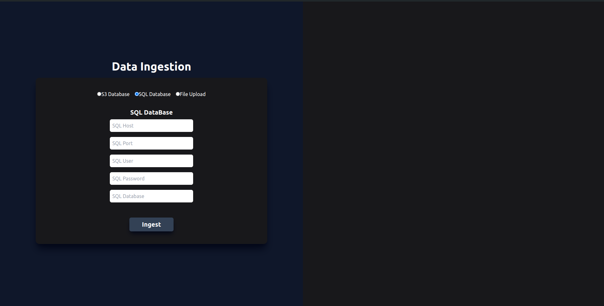
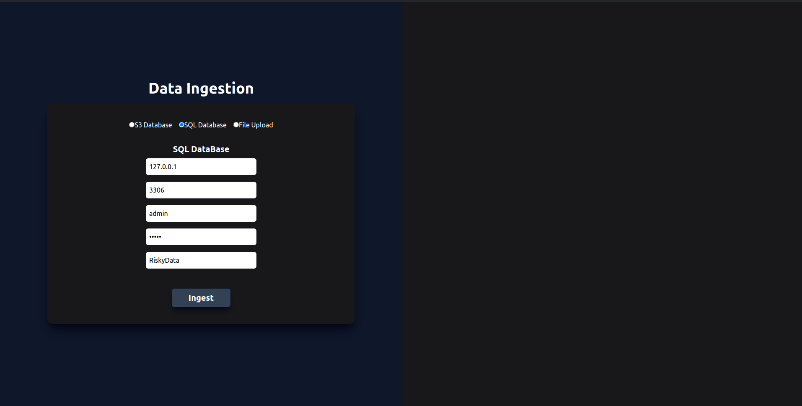
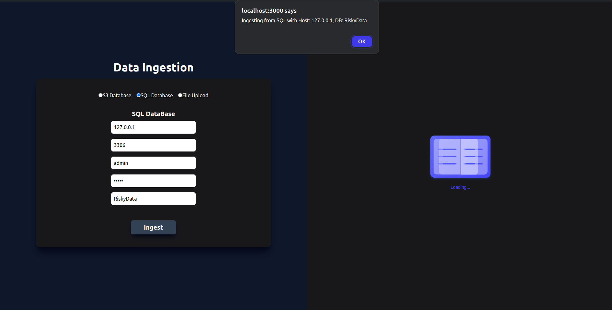
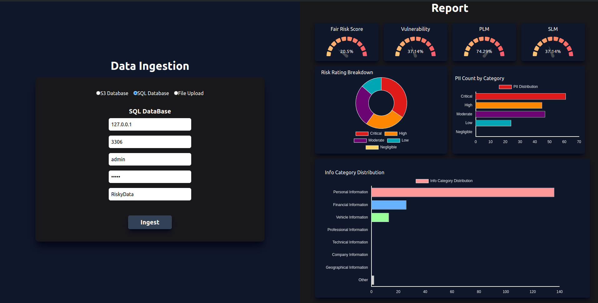

# PII Detection

## Overview

PII Detection is a project focused on identifying and protecting Personally Identifiable Information (PII) within text. This repository contains code and resources for fine-tuning and evaluating models for PII detection using RoBerta model and fine tunning it on a mix of publicly available dataset and a custom made dataset reaching an f1, auroc and recall of about 90%.

## Features

- Fine-tuned RoBERT-A model for PII detection
- Support for a wide range of PII categories
- Tools for training, evaluating, and deploying PII detection models
- Integration with various data sources (MySql (Structured data), Cloud Storage (AWS s3) and File Systems) for performing Risk Analysis based on FAIR Assessment.

## Installation

To get started with this project, you'll need to set up your environment and install the necessary dependencies. Here’s how to do it:

1. **Clone the Repository**

   ```bash
   git lfs clone https://github.com/Harsh200112/PII_Detection.git
   cd PII_Detection
   ```

2. **Create a Virtual Environment**

   ```bash
   python -m venv env
   source env/bin/activate  # On Windows use `env\Scripts\activate`
   ```

3. **Install Dependencies**

   ```bash
   pip install -r requirements.txt
   ```

## Usage

### Frontend

To start the frontend of the application:

```bash
cd frontend/pii_detection
npm start
```

### Backend

To start the backend of the application:

```bash
cd frontend/pii_detection
python manage.py runserver
```

### Airflow Data Pipline 

To Run the data flow pipeline for pii detection from different databases and local files respectively:

```bash
export AIRFLOW_HOME="/home/harsh/Desktop/Airflow"
airflow webserver -p 5000
```

```bash
export AIRFLOW_HOME="/home/harsh/Desktop/Airflow"
airflow scheduler
```

## Backend API Contracts
The api contracts can be found in 
```bash
API.yaml
```

## Data

The project uses several datasets for training and evaluation, including:

- **PII_Masking_43k**: A dataset for fine-tuning PII detection models.
- **Custom Data**: We have created custom data for the PII entities that were lacking in the above dataset. The code to this is in the directory given below.
  ```bash
  PII_Detection_Pipeline/Dataset Preparation
  ```

## Trained Model

The trained model and tokenizer files can be found in:
```bash
PII_Detection_Pipeline/Trained Weights/fine_tuned_roberta_pii
```

- Model Evaluation Results:-


## Application Usage
Step-1 : 

Step-2 : 

Step-3 : 

Step-4 : 


## Acknowledgements

- Special thanks to the creators of the BERT model and associated libraries.
- Thanks to all contributors and the open-source community for their support.
For any questions or feedback, please open an issue on the [GitHub repository](https://github.com/Harsh200112/PII_Detection) or contact us directly at [Harsh Soni](mailto:harsh.l.soni1@gmail.com) or [Vicky Kumar](mailto:vicky.jnv898@gmail.com).
